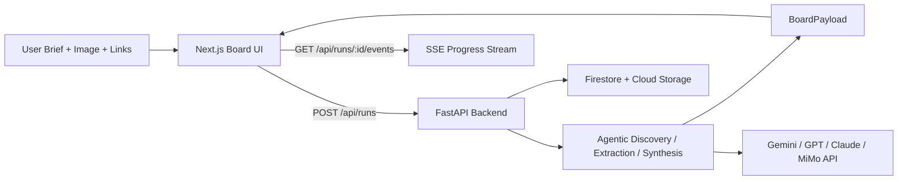

# Architecture

## Product Boundary
This project intentionally avoids broad crawling, a hidden persistent memory plane, and voice-first UX as the main interface. The judged path is narrow: structured brief, image input, selected links, streamed progress, and board-first output.

## Components

### Frontend
The intended frontend is a Next.js board-style app. It handles:
- brief and input capture;
- run creation;
- SSE event consumption;
- board rendering from a single final payload;
- demo-mode entry for stable review.

### Backend
The intended backend is a FastAPI service. It handles:
- run and session creation;
- SSE progress streaming;
- live and fallback execution branches;
- image intake;
- final board payload delivery.

### Shared Contract
`BoardPayload` is the main cross-layer contract. The frontend should render from it directly, and the backend should return it in both fallback and live modes with the same structural shape.

### Storage
The intended storage model is:
- Firestore for run/session metadata;
- Cloud Storage for uploaded images and media artifacts.

### Deployment
The intended deployment shape is:
- Firebase App Hosting for the frontend;
- Cloud Run for the backend.

## Run Lifecycle
1. User submits a brief and inputs.
2. Backend creates a run.
3. Frontend subscribes to SSE.
4. Backend emits progress events.
5. Agent pipeline performs discovery, extraction, normalization, and synthesis.
6. Backend returns a `BoardPayload`.
7. Frontend renders the board.

## Failure Handling
- fallback/demo mode for deterministic review;
- warning surfaces for partial degradation;
- low-source path handling;
- audio-unavailable handling;
- explicit failed runs when a usable board cannot be produced.

## Guardrails
- no broad crawling;
- no hidden persistent memory plane;
- no voice-first dependency;
- bounded discovery;
- citation-aware output;
- evidence-vs-inference separation.

## Diagram

